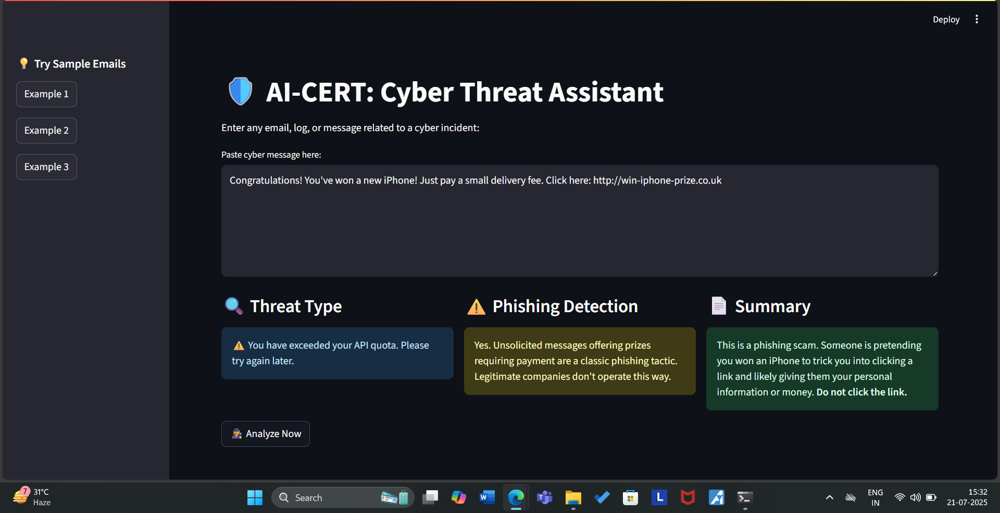

# AI-CERT Threat Analyzer

This is an AI-powered phishing and threat classification tool built using:

- 🔠Gemini Pro API (Google Generative AI)
- ğŸ–¥ï¸ Streamlit for web app UI
- 📠Python for backend logic

## 🔧 Features

- Classifies input as **Phishing**, **Malware**, **Suspicious**, or **Harmless**
- Summarizes incidents using Gemini
- Lightweight and fully software-based — no hardware needed

## ğŸ› ï¸ Setup Instructions

1. Clone the repo
2. Install dependencies:
   
#pip install -r requirments.txt

3. Add your Gemini API key in a `.env` file:

#GEMINI_API_KEY=your_key_here

4. Run the app:

---

## 🔠Note
Do not commit your `.env` file — use `.env.example` for sharing.

---

Let me know if you'd like me to generate a **ZIP of all files**, help you **deploy this online**, or prepare a **presentation or demo** for your competition.

You're doing an excellent job getting this project ready! 💪

